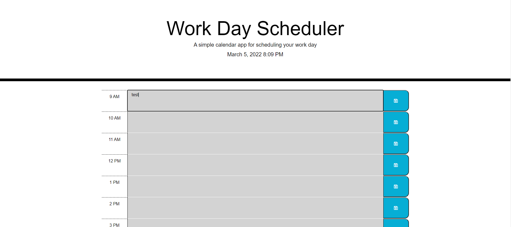
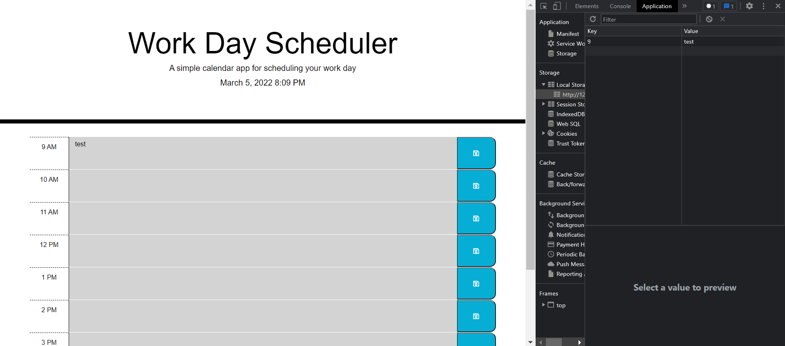

# Day Planner

## Table of Contents
- [Description](#description)
- [Visuals](#visuals)
- [Links](#links)

## Description

This project is a day planner that shows what hour it is actively, which hours have passed, and which have to come in the current day. It then saves the data written in each text box, when the save button is clicked, to local storage. This is done using Moment.js and jQuery.

## Visuals

## Links

Deployed site: https://buggiess.github.io/em-planner/

